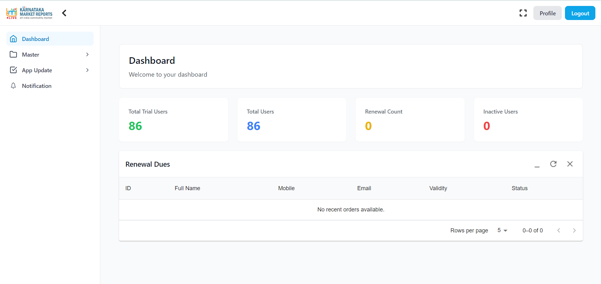
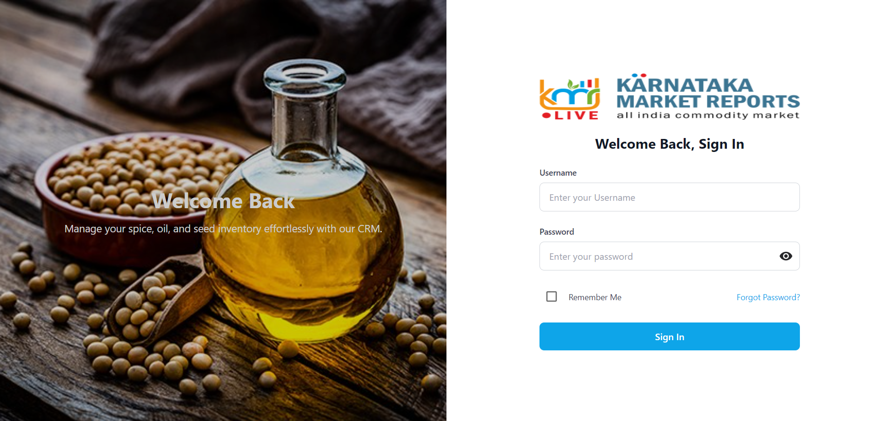
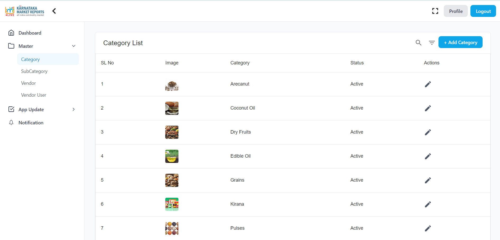

# KMR CRM

## 📌 Project Overview

**KMR CRM** is a customer relationship management (CRM) system designed for **AG Solutions Bangalore** to efficiently manage vendors, news, notifications, and more. The project is built using **React (Vite)** with **MUI, TailwindCSS, Axios, and other modern libraries**.

---

## 📁 Directory Structure

```
KMR-CRM/
├── README.md              # Project documentation
├── index.html             # Main HTML file
├── package.json           # Project dependencies & scripts
├── postcss.config.js      # Tailwind/PostCSS configuration
├── tailwind.config.js     # Tailwind configuration
├── vite.config.js         # Vite configuration
├── public/                # Static assets
└── src/                   # Source files
    ├── App.jsx           # Main App component
    ├── main.jsx          # React DOM rendering
    ├── index.css         # Global styles
    ├── assets/           # Static assets (images, icons, etc.)
    ├── config/
    │   └── BaseUrl.jsx   # API configuration
    ├── components/       # Reusable UI components
    │   ├── Layout.jsx
    │   ├── Navbar.jsx
    │   └── Sidebar.jsx
    ├── pages/            # Application pages
    │   ├── home/         # Dashboard & Home
    │   │   └── Dashboard.jsx
    │   ├── auth/         # Authentication
    │   │   ├── SignIn.jsx
    │   │   └── ForgetPassword.jsx
    │   ├── appUpdates/   # News, Rates, Live Updates
    │   ├── Master/       # Master Data (Category, Vendor, etc.)
    │   ├── Notification/ # Notifications
    │   ├── Profile/      # User Profile
    │   └── websiteEnquiry/ # Website Enquiries
```

---

## 🚀 Tech Stack

- **Frontend:** React (Vite), TailwindCSS, MUI
- **State Management:** React Context API
- **API Handling:** Axios
- **Data Validation:** Formik & Yup
- **Charts & Visuals:** Chart.js, Highcharts
- **Notifications:** React Toastify, Sonner

---

## 📦 Installation & Setup

### 1️⃣ Clone the Repository

```bash
git clone https://github.com/AG-Solutions-Bangalore/kmr-crm
cd kmr-crm
```

### 2️⃣ Install Dependencies

```bash
npm install
```

### 3️⃣ Start the Development Server

```bash
npm run dev
```

---

## 🛠️ Available Scripts

| Command           | Description                        |
| ----------------- | ---------------------------------- |
| `npm run dev`     | Start development server (Vite)    |
| `npm run build`   | Build the project for production   |
| `npm run lint`    | Run ESLint for code quality checks |
| `npm run preview` | Preview the production build       |

---

## 🔑 Environment Variables

Create a `.env` file in the root directory and add:

```env
VITE_BASE_URL=https://your-api-url.com
VITE_NO_IMAGE_URL=/path/to/no-image.png
```

---

## 📌 Features

✅ User Authentication (Login, Forgot Password)  
✅ Vendor & Category Management  
✅ News & Updates Management  
✅ Dashboard with Interactive Charts  
✅ Notifications & Website Enquiries  
✅ Responsive UI with Tailwind & MUI  
✅ API Integration using Axios

---

## 📸 Screenshots

### 🏠 Home Page



### Sign-in Page 🔑



### 📂 Category Page



---

## 🤝 Contributing

Feel free to submit a pull request or report an issue.

---

## 📝 License

This project is licensed under the **MIT License**.

---

## 📬 Contact
📩 **Need Help?** Contact us at `https://ag-solutions.in/contact.php` or open an issue on GitHub! 🚀
